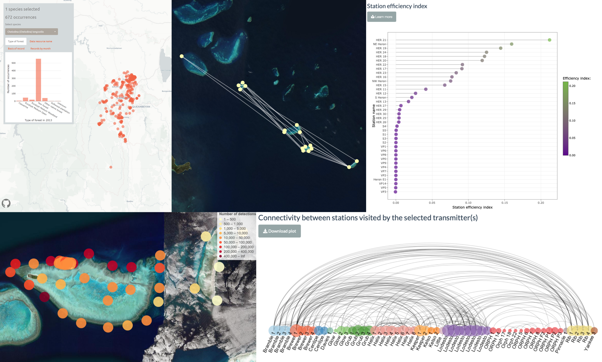

# About me

I am a passionate Environmental Scientist with a Masters degree in Marine Science and Management from the University of Sydney. I am currently working as a Data Officer for the <strong>Integrated Marine Observing System - Animal Tracking Facility </strong>(IMOS-ATF) and recently started a Masters degree in Data Science at the University of Adelaide.

<i class="fas fa-globe"></i> <a href="https://fmaron.github.io/fmaron/" target="_blank">Portfolio Website</a>

